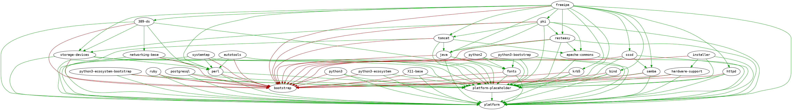

# Modularity dependency reports

This repository contains scripts to generate dependencies of the initial set of modules in F27.

Modules are defined in the [modularity-modules](https://github.com/modularity-modules) space. The input is taken from the respective README.md files.

## Output

Output is stored in the [modules directory](modules).

Module dependencies are resolved for all architectures: `aarch64`, `armv7hl`, `i686`, `ppc64`, `ppc64le`, `s390x`, `x86_64`. There are many files with different levels of detail. Please see the example below for more info.

Right now, the **following modules are included**. This image is automatically generated each time the scripts are run.



### Structure

#### Three major groups

* module/arch/**runtime**-...txt - All source SRPM dependencies excluding Platform and modular dependencies.
* module/arch/**standalone-runtime**-...txt - All binary RPM dependencies excluding Platform only.
* module/arch/**complete-runtime**-...txt - Complete runtime dependencies. Not very usable output.

#### Binary RPM vs. source SRPM

* module/arch/...-**source**-...txt** - Source SRPM packages.
* module/arch/...-**binary**-...txt** - Binary RPM packages.

#### Names only vs. NEVRA

* module/arch/...-**full**.txt - Full package names and versions in the NEVRA format.
* module/arch/...-**short**.txt - Only package names.

## Scripts

### 1. Get the module definitions

Clones all [modularity-modules](https://github.com/modularity-modules) repos listed in `repos/repolist.txt`. These repositories define the top-level package sets and are owned by the module maintainers.

```
$ ./clone_repos.sh
```

### 2. Extract module package lists from README files

Generates machine-readable top-level package lists for modules from all repositorires.

```
$ ./generate_lists.sh
```

### 3. Get the Host & Platform modules data

The [Host & Platform](https://github.com/fedora-modularity/hp) is a set of modules or module stacks defining the base operating system. It is needed to resolve the `standalone-*` package lists.

```
$ ./get_hp.sh
```

### 4. Generate deps for all modules

Generate the `complete-runtime-*` and `standalone-runtime-*` package lists for all modules on all architectures. 

```
$ ./resolve_modules.sh
```

### 5. Figure out dependencies

Generate the `rumtime-*` package lists for all modules on all architectures.

```
$ ./deps.sh
```
