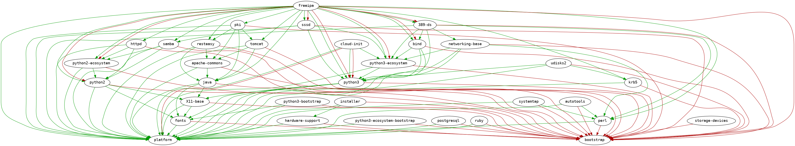

# Global reports

## There are 25 modules:

| Module | RPM compnents | RPMs missing in buildroot |
|---|---|---|
| [**389-ds**](../modules/389-ds) | 21 | [83 pkgs missing](../modules/389-ds/all/buildtime-binary-packages-short.txt) |
| [**autotools**](../modules/autotools) | 3 | [314 pkgs missing](../modules/autotools/all/buildtime-binary-packages-short.txt) |
| [**bind**](../modules/bind) | 12 | [30 pkgs missing](../modules/bind/all/buildtime-binary-packages-short.txt) |
| [**freeipa**](../modules/freeipa) | 67 | [227 pkgs missing](../modules/freeipa/all/buildtime-binary-packages-short.txt) |
| [**httpd**](../modules/httpd) | 12 | [115 pkgs missing](../modules/httpd/all/buildtime-binary-packages-short.txt) |
| [**installer**](../modules/installer) | 65 | [1 pkgs missing](../modules/installer/all/buildtime-binary-packages-short.txt) |
| [**java**](../modules/java) | 9 | [142 pkgs missing](../modules/java/all/buildtime-binary-packages-short.txt) |
| [**krb5**](../modules/krb5) | 5 | [1 pkgs missing](../modules/krb5/all/buildtime-binary-packages-short.txt) |
| [**networking-base**](../modules/networking-base) | 61 | [311 pkgs missing](../modules/networking-base/all/buildtime-binary-packages-short.txt) |
| [**perl**](../modules/perl) | 141 | [643 pkgs missing](../modules/perl/all/buildtime-binary-packages-short.txt) |
| [**pki**](../modules/pki) | 36 | [299 pkgs missing](../modules/pki/all/buildtime-binary-packages-short.txt) |
| [**platform**](../modules/platform) | 299 | [1 pkgs missing](../modules/platform/all/buildtime-binary-packages-short.txt) |
| [**platform-placeholder**](../modules/platform-placeholder) | 359 | [1 pkgs missing](../modules/platform-placeholder/all/buildtime-binary-packages-short.txt) |
| [**postgresql**](../modules/postgresql) | 2 | [44 pkgs missing](../modules/postgresql/all/buildtime-binary-packages-short.txt) |
| [**python2**](../modules/python2) | 23 | [146 pkgs missing](../modules/python2/all/buildtime-binary-packages-short.txt) |
| [**python3**](../modules/python3) | 22 | [145 pkgs missing](../modules/python3/all/buildtime-binary-packages-short.txt) |
| [**python3-bootstrap**](../modules/python3-bootstrap) | 0 | [0 pkgs missing](../modules/python3-bootstrap/all/buildtime-binary-packages-short.txt) |
| [**python3-ecosystem**](../modules/python3-ecosystem) | 0 | [0 pkgs missing](../modules/python3-ecosystem/all/buildtime-binary-packages-short.txt) |
| [**python3-ecosystem-bootstrap**](../modules/python3-ecosystem-bootstrap) | 0 | [0 pkgs missing](../modules/python3-ecosystem-bootstrap/all/buildtime-binary-packages-short.txt) |
| [**resteasy**](../modules/resteasy) | 39 | [483 pkgs missing](../modules/resteasy/all/buildtime-binary-packages-short.txt) |
| [**samba**](../modules/samba) | 27 | [556 pkgs missing](../modules/samba/all/buildtime-binary-packages-short.txt) |
| [**sssd**](../modules/sssd) | 24 | [71 pkgs missing](../modules/sssd/all/buildtime-binary-packages-short.txt) |
| [**storage-devices**](../modules/storage-devices) | 78 | [485 pkgs missing](../modules/storage-devices/all/buildtime-binary-packages-short.txt) |
| [**systemtap**](../modules/systemtap) | 14 | [254 pkgs missing](../modules/systemtap/all/buildtime-binary-packages-short.txt) |
| [**tomcat**](../modules/tomcat) | 23 | [309 pkgs missing](../modules/tomcat/all/buildtime-binary-packages-short.txt) |
